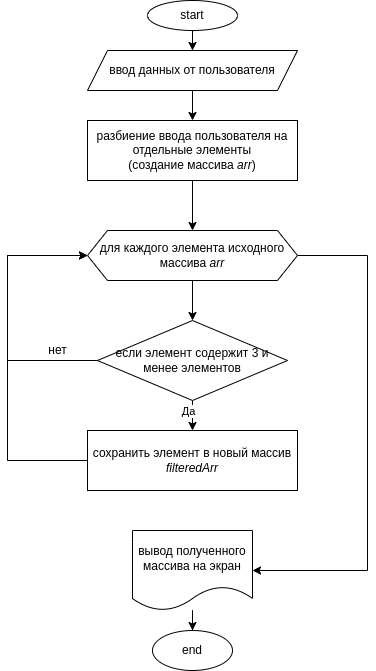

# IntroFinal

### __Задача. Условие__

> Написать программу, которая из имеющегося массива строк формирует массив из строк, длина которых меньше либо равна 3 символам. Первоначальный массив можно ввести с клавиатуры, либо задать на старте выполнения алгоритма. при решении не рекомендуется пользоваться коллекциями, лучше обойтись исключительно массивами.

### __Алгоритм решения__
1. Считываем массив строк из стандартного ввода, для определенности полагаем что элементы массива разделены запятыми
2. Обрабатываем считанную строку для получения массива "чистых" элементов без пробелов и запятых - *arr*
3. Проходим поочередно по всем элементам, полученного массива *arr*
    1. Если длина элемента меньше либо равна 3, то переносим его в отдельный массив - *filteredArr*
4. Выводим на экран поочередно все отобранные элементы исходного массива, для демонстрации успешного выполнения задачи

### __Блок-схема алгоритма__

